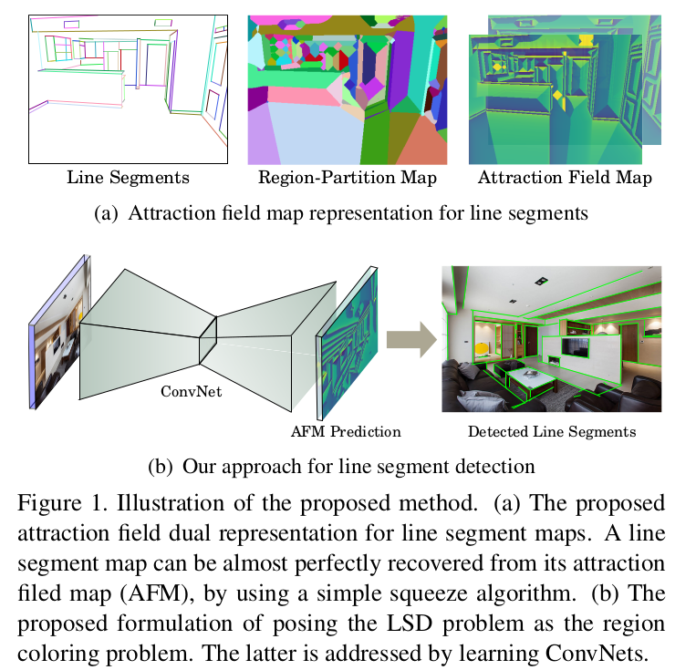
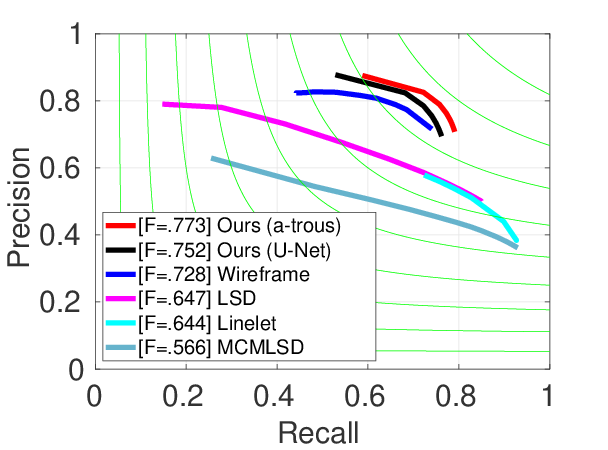

# Learning Attraction Field Reprensentation for Robust Line Segment Detection (accepted by CVPR 2019)

This is the offical implementation for our [CVPR paper](https://arxiv.org/abs/1812.02122).

## Introduction
We reformulate the problem of line segment detection (LSD) as a coupled region coloring problem. Based on this new formulation, we can address the problem of LSD with convolutional neural networks.
<p align="center">

<p>

## Results

### F-Measure and FPS

| Methods | Wireframe Dataset | YorkUrban Dataset | FPS|
|:-----:|:-----:|:-----:|:-----:|
| [LSD](https://ieeexplore.ieee.org/document/4731268/) | 0.647 | 0.591 | 19.6|
| [MCMLSD](http://www.elderlab.yorku.ca/wp-content/uploads/2016/12/Almazan_MCMLSD_A_Dynamic_CVPR_2017_paper.pdf) | 0.566 | 0.564 | 0.2 |
| [Linelet](https://github.com/NamgyuCho/Linelet-code-and-YorkUrban-LineSegment-DB)| 0.644 | 0.585 | 0.14|
| [Wireframe Parser](https://github.com/huangkuns/wireframe)| 0.728 | 0.627 | 2.24|
|**Ours (U-Net)**| **0.752** | **0.639** | **10.3**|
|**Ours (a-trous)**| **0.773** | **0.646** | **6.6**|

### Precision and Recall Curves
<p align="center">


</p>

## Installation
Check [INSTALL.md](INSTALL.md) for installation instructions.


## 1.Data preparation
### 1.1 Downloading data
- Wireframe Dataset: https://github.com/huangkuns/wireframe
- YorkUrban Dataset: http://www.elderlab.yorku.ca/resources/york-urban-line-segment-database-information/

Please follow the above links to download Wireframe and YorkUrban datasets. For Wireframe dataset, we only need the file named pointlines.zip which contains images and line segment annotations for training and testing. 

Once the files are downloaded, please unzip them into <AFM_root>/data/wireframe_raw and <AFM_root>/data/york_raw  respectively. The structures of wireframe_raw and york_raw folder are as follows:
```
wireframe_raw/
    - pointlines/*.pkl
    - train.txt
    - test.txt

york_raw/
    - filename0_rgb.png
    - filename0.mat
    ...
    - filename{N}_rgb.png
    - filename{N}.mat
```

### 1.2. Data Pre-processing
Please run the following commands
```
cd <AFM_root>/data/
python preparation_wireframe.py
python preparation_york.py
```

## 2. Hyper-parameter configurations
We use the [YACS](https://github.com/rbgirshick/yacs) to control the hyper parameters. Our configuration files for U-Net [(afm_unet.yaml)](experiments/afm_unet.yaml) and a-trous Residual Unet [(afm_atrous.yaml)](experiments/afm_atrous.yaml) are saved in the "<AFM_root>/experiments" folder.

In each yaml file, the SAVE_DIR is used to store the network weights and experimental results. The weights are saved in SAVE_DIR/weights and the results are saved in SAVE_DIR/results/DATASET_name.

The TEST configuration is for outputing results in testing phase with different ways (e.g. save or display). We currently provide two output modes "display" and "save". 
You can custom more output methods in [modeling/output/output.py](modeling/output/output.py). 

## 3. Inference with pretrained models
The pretrained models for U-Net and atrous Residual U-Net can be downloaded from [this link](https://drive.google.com/file/d/1AnLWs91vQdsJm6jJhB7MAvbIIQc0hJL2/view?usp=sharing). Please place the weights into "<AFM_root>/experiments/unet/weight" and "<AFM_root>/experiments/atrous/weight" respectively. 

- For testing, please run the following command

```
python test.py --config-file experiments/afm_atrous.yaml --gpu 0
```


## 4. Training
Please run the following command 
```
python train.py --config-file experiments/afm_atrous.yaml --gpu 0
```
to train a network. To speedup training procedure, our code will save the generated attraction field maps into <AFM_root>/data/wireframe/.cache when you run training code in the first time.


## 5. Citations
If you find our work useful in your research, please consider citing:
```
@inproceedings{AFM,
title = "Learning Attraction Field Representation for Robust Line Segment Detection",
author = "Nan Xue and Song Bai and Fudong Wang and  Gui-Song Xia and Tianfu Wu and Liangpei Zhang",
booktitle = "IEEE Conference on Computer Vision and Pattern Recognition (CVPR)",
year = {2019},
}
```
